:::::::::::::::::::::::::::::::::::::: questions

- How do I create a repository on GitHub?
- How do I record (commit) changes?
- How do I browse changes?
- What repository insights and settings are available?

::::::::::::::::::::::::::::::::::::::::::::::::

::::::::::::::::::::::::::::::::::::: objectives

- Create a new repository using the GitHub web interface
- Create and edit files directly on GitHub
- Write clear, descriptive commit messages
- Browse a repository's commit history
- Use Markdown to format text

::::::::::::::::::::::::::::::::::::::::::::::::

We will practice creating a new repository using the web interface, committing
changes to it, browsing the changes, creating branches, and more.
This is everything you need to do basic file management, though you'll
probably want something faster to use. Still, it can be good for
quick edits and contributions.

## Step 1: Create a repository with a README and a license

You start off by creating a repository from the web. In fact, we
usually end up doing this from the web, no matter how you do your daily
work. The important questions are who is the *owner* and what is the
*name* of the repository.

Make sure that you are **logged into GitHub**.

To create a repository we either click the green button "New" (top left corner):

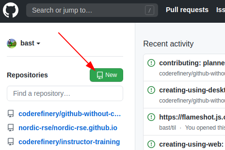{alt='Screenshot of the GitHub interface highlighting the green New button in the top left corner'}

Or if you see your profile page, there is a "+" menu (top right corner):

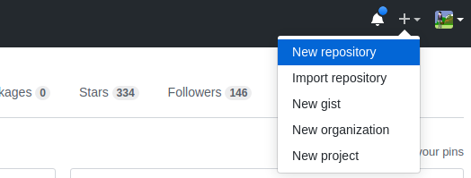{alt='Screenshot of the GitHub interface highlighting the plus icon menu in the top right corner'}

We then land at the following form. Please fill it out and set **Initialize
this repository with a README**. Leave "Choose a License" as "None" for now
— we will cover choosing a license in a later episode.

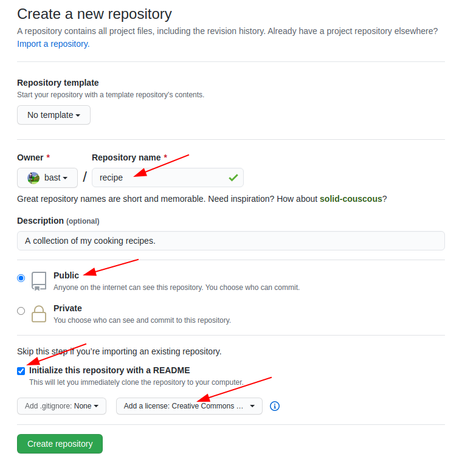{alt='Screenshot of the GitHub new repository creation form'}

And now we have a repository with a README and LICENSE and one commit:

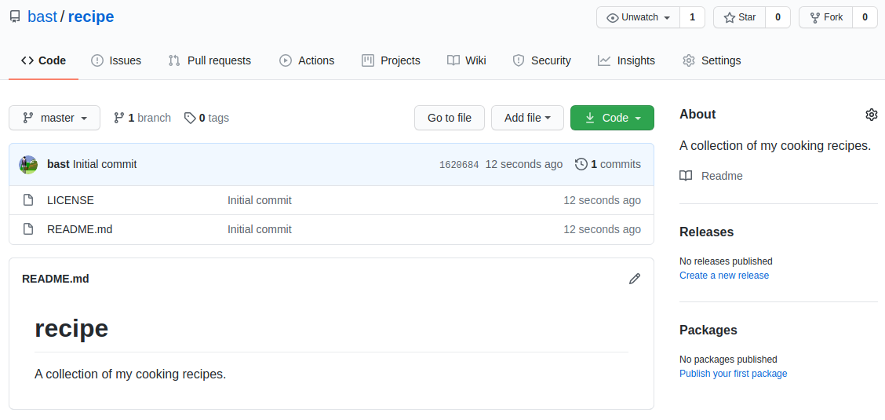{alt='Screenshot of a newly created GitHub repository showing the README and one commit'}

## Step 2: Create a new file

We can easily add new files from the web interface.

Create a file, e.g. `guacamole.md` (the "md" ending signals that this is in Markdown format):

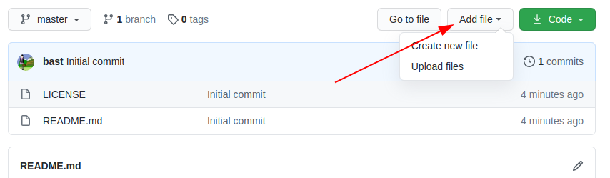{alt='Screenshot of the GitHub interface highlighting the buttons for creating a new file'}

In the new file you can share your favorite cooking recipe (or something else).
You can also copy-paste this as a starting point:

```
Ingredients:
- 2 avocados
- 1 lime
- 2 tsp salt

Instructions:
- cut and mash avocados
- chop onion
- squeeze lime
- add salt
- and mix well
```

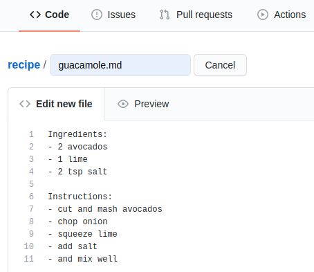{alt='Screenshot of the GitHub web editor with recipe content entered'}

Then add a commit message and commit (save):

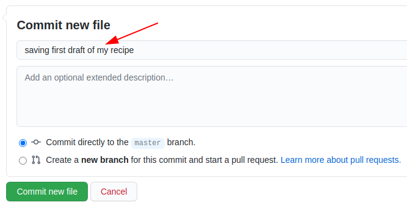{alt='Screenshot of the GitHub commit form for a new file'}

::::::::::::::::::::::::::::::::::::: discussion

## Discussion: Good commit messages

- What has changed is more useful than which file has changed
- Sometimes we forget to document *why* something was changed
- Many projects start out as projects "just for me" and end up to be successful projects
  that are developed by 50 people over decades.
- Write commit messages in English that will be understood
  15 years from now by someone else than you.
- ["My favourite Git commit"](https://fatbusinessman.com/2019/my-favourite-git-commit)
- ["On commit messages"](https://who-t.blogspot.com/2009/12/on-commit-messages.html)
- ["How to Write a Git Commit Message"](https://chris.beams.io/posts/git-commit/)

::::::::::::::::::::::::::::::::::::::::::::::::

## Step 3: Modify a file

We can also easily modify files from the web.

Now improve the recipe by adding an ingredient or an instruction step:

- Click on the file.
- Click the "pen" icon on top right ("edit this file").

Make an improvement, write a commit message, commit:

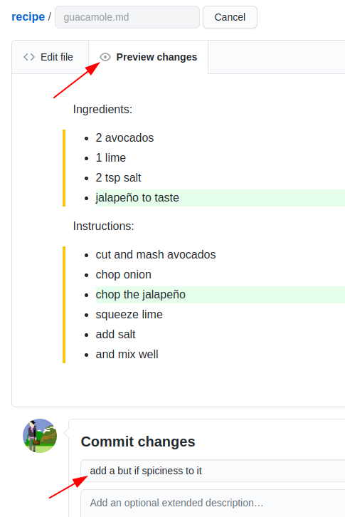{alt='Screenshot of the GitHub file editor showing a diff preview'}

Once you have done that, browse your commits:

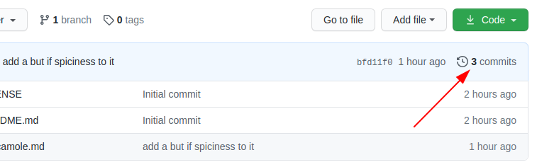{alt='Screenshot of the GitHub commits list'}

In this example, the commit history looked like:

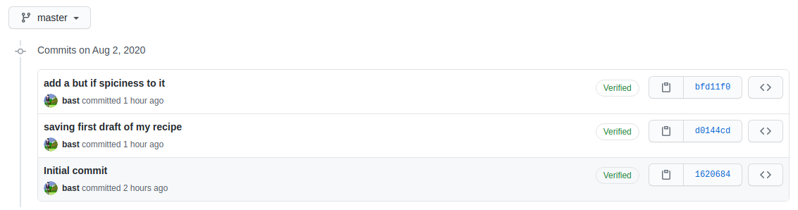{alt='Screenshot of an example commit history with several commits'}

In this episode, we saw how we could do basic file management from the
web. It's not the best for making lots of new content, but it's
pretty convenient for quick edits. We will now see more advanced ways
to do the same things - you can always check back on the web to see
the effect.

## Markdown

Markdown is a lightweight markup language for creating formatted text using a
plain-text editor. John Gruber and Aaron Swartz created Markdown in 2004
([Wikipedia](https://en.wikipedia.org/wiki/Markdown)).

To practice using Markdown, and seeing how it is formatted, open up a
[new CodiMD document](https://codimd.carpentries.org/new) in your browser.

By default, the document will open in rendered view, but click on the middle
split pane icon in the top left to show the Markdown and rendered views
side-by-side.

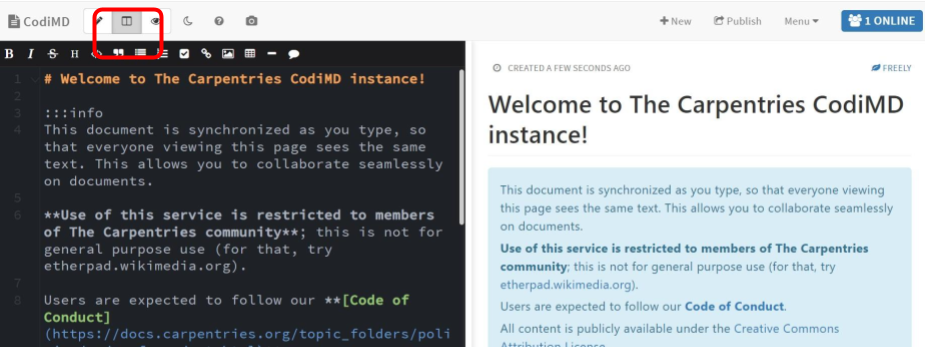{alt='Screenshot of CodiMD showing the Markdown source and rendered preview side by side'}

Now using the CodiMD interface, we will learn the following Markdown equivalents:

- Headers
- Bold
- Italics
- Bullets
- Ordered Lists
- Images
- Links

::::::::::::::::::::::::::::::::::::: challenge

## Exercise: Practice Markdown

Use as many of the Markdown skills you just learned to edit either the
README.md or guacamole.md files.

::::::::::::::::::::::::::::::::::::::::::::::::

::::::::::::::::::::::::::::::::::::: keypoints

- You can create, edit, and commit files directly from the GitHub web interface.
- Good commit messages explain *what* changed and *why*.
- Markdown is a lightweight formatting language used throughout GitHub.

::::::::::::::::::::::::::::::::::::::::::::::::
