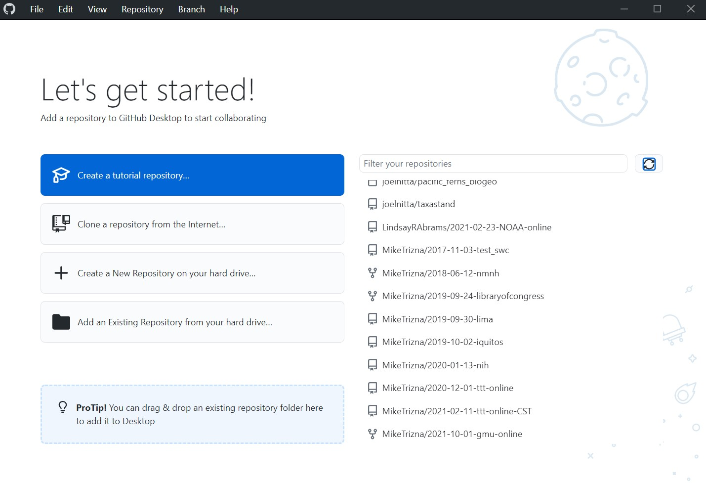
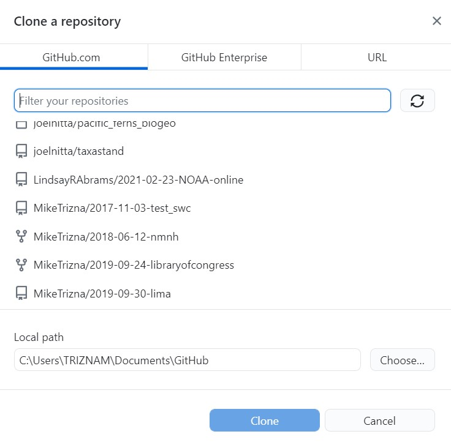
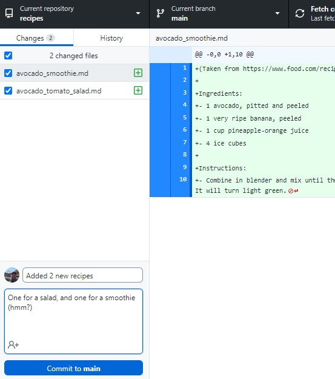
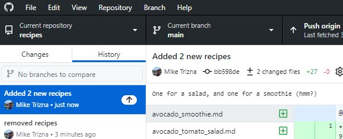
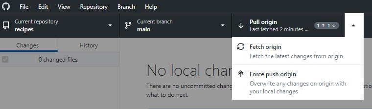
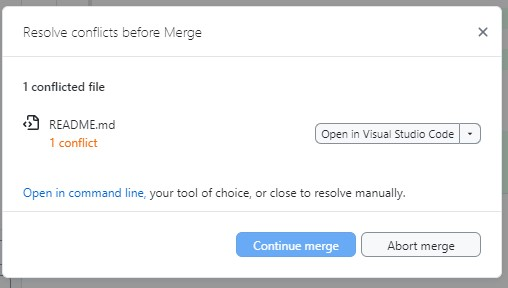
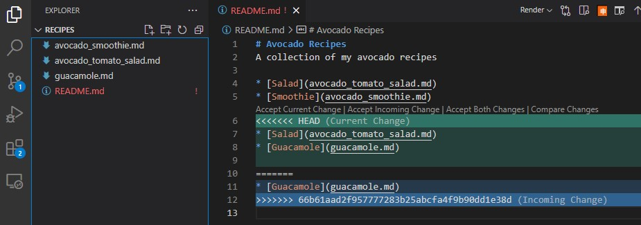

:::::::::::::::::::::::::::::::::::::: questions

- How do I clone a repository using GitHub Desktop?
- How do I commit and push changes using GitHub Desktop?
- What happens when conflicting changes are made in two places?

::::::::::::::::::::::::::::::::::::::::::::::::

::::::::::::::::::::::::::::::::::::: objectives

- Clone an existing repository using GitHub Desktop
- Add, commit, and push changes using GitHub Desktop
- Recognize and resolve a merge conflict

::::::::::::::::::::::::::::::::::::::::::::::::

**Scenario**: You've created a repository through the web interface, but now
you have multiple files that you would like to add. *Do you see an easy way
to do this in the web interface?*

## Step 1: Open GitHub Desktop and Sign In

{alt='Screenshot of the GitHub Desktop welcome screen'}

On Windows, go to File > Options. On Mac, go to GitHub Desktop > Preferences.

On the Accounts tab, click the Sign In button to sign in with your GitHub
credentials in the browser.

Even though the friendly welcome screen has a big button to clone a
repository, that welcome screen won't always be there. The more consistent
way to do this is to click on File > Clone repository.

{alt='Screenshot of the GitHub Desktop Clone a repository window'}

In the Github.com tab, all of your repositories will be listed. Scroll until
you find the recipes repository you created in the previous lesson.

Now choose a folder on your computer where it makes sense to save those
files. The default is probably fine, but remember where it is.

Click Clone to download the files ... and all of the associated history to
your computer.

## Step 2: Add new files to the cloned directory

Download this zip file from
[https://github.com/MikeTrizna/github-without-command-line/raw/master/data/avocado_recipes.zip](https://github.com/MikeTrizna/github-without-command-line/raw/master/data/avocado_recipes.zip),
and unzip to your Downloads folder (or anywhere else, temporarily). This .zip
file contains 2 more avocado recipes in Markdown format, but you could
imagine it containing several more.

Copy or move the new Markdown files to the directory that you cloned from
GitHub.

::::::::::::::::::::::::::::::::::::: challenge

## Exercise

*How has the Changes tab of the GitHub Desktop window updated?*

::::::::::::::::::::::::::::::::::::::::::::::::

Enter a commit message and description at the bottom of the Changes tab, and
click the blue Commit button.

{alt='Screenshot of the Changes tab in GitHub Desktop showing new files'}

Now check out the History tab to see your latest commit.

{alt='Screenshot of the History tab in GitHub Desktop showing the latest commit'}

Browse to the repository on the GitHub website. *Do you see the changes you
just made?*

Even though you have committed the changes to the Git history, they have not
made their way to the GitHub repository. You will need to click to Push
changes button in the top right to send them to GitHub. Do that now.

Now the changes should appear on GitHub.

## Step 3: Make a conflicting change

But what happens if you (or a collaborator) make conflicting changes on the
GitHub website and on your local copy?

Make a change in the README.md file of the web version to add internal links
to the new recipes. On the web add the link to avocado_tomato_salad.md
first, and then avocado_smoothie.md second.

It should look like this:

```
# Avocado Recipes
A collection of my avocado recipes

* [Salad](avocado_tomato_salad.md)
* [Smoothie](avocado_smoothie.md)
* [Guacamole](guacamole.md)
```

Commit this change.

Now open the local copy of your README.md in a text editor, and add internal
links to avocado_smoothie.md first, and then avocado_tomato_salad.md second.
Commit the change.

It should look like this:

```
# Avocado Recipes
A collection of my avocado recipes

* [Smoothie](avocado_smoothie.md)
* [Salad](avocado_tomato_salad.md)
* [Guacamole](guacamole.md)
```

Try to push the changes to GitHub. *What new options appear in the place of
"Push origin"?*

{alt='Screenshot of GitHub Desktop showing new options in place of Push origin'}

Click on "Pull origin". You should get a warning like this:

{alt='Screenshot of GitHub Desktop warning about merge conflicts that need to be resolved'}

Go back to the local copy of the README.md file in a text editor. *What has
changed?*

{alt='Screenshot of a text editor showing Git conflict markers in the README file'}

Now remove the conflicting text lines, and try pushing to GitHub again.

::::::::::::::::::::::::::::::::::::: callout

## Resolving conflicts

Running into a git conflict is scary. If you feel like you are digging a
deeper hole as you try to resolve the conflict (and the changes you are
trying to make are minor), you can always remove the local copy of the
repository and clone it from GitHub again from scratch.

::::::::::::::::::::::::::::::::::::::::::::::::

::::::::::::::::::::::::::::::::::::: keypoints

- GitHub Desktop can clone, commit, and push changes without using the
  command line.
- Changes committed locally are not visible on GitHub until they are pushed.
- A conflict happens when the same lines of a file are changed in two
  places; Git needs your help to decide which version to keep.

::::::::::::::::::::::::::::::::::::::::::::::::
