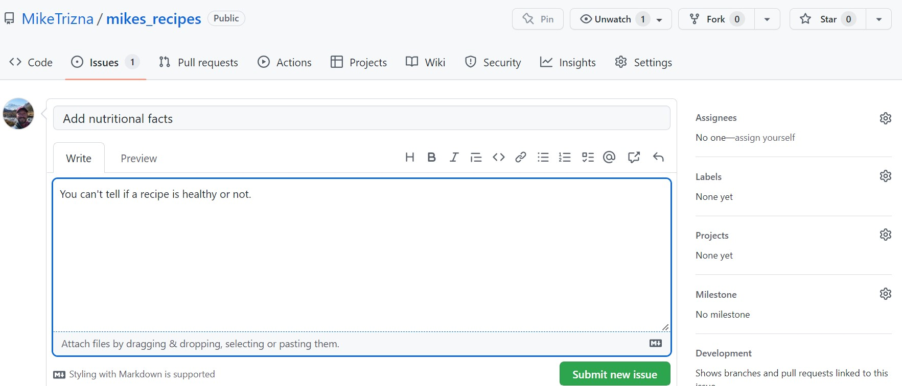
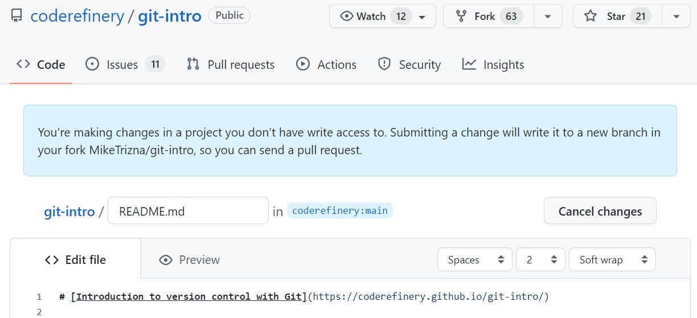
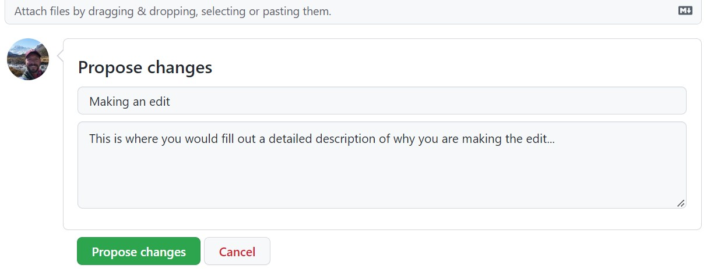
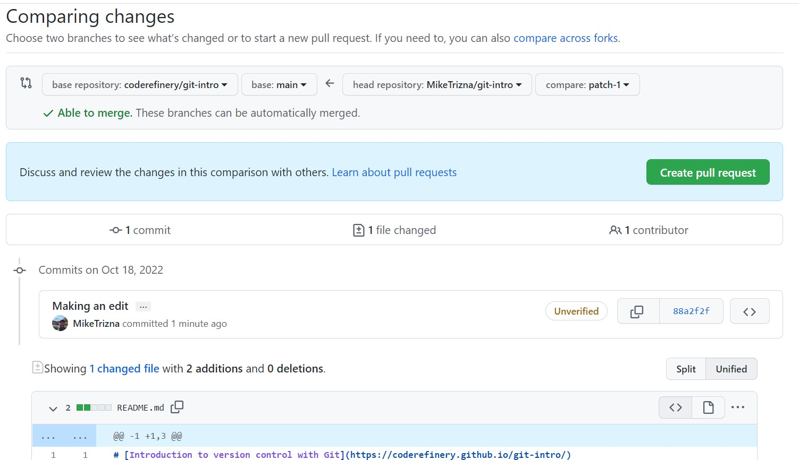

:::::::::::::::::::::::::::::::::::::: questions

- How do I submit small changes using pull requests?
- How do I propose and submit larger changes?
- How do I review and discuss changes?

::::::::::::::::::::::::::::::::::::::::::::::::

::::::::::::::::::::::::::::::::::::: objectives

- File an issue on a repository
- Fork and edit a file on someone else's repository
- Create a pull request to propose changes
- Review and respond to issues and pull requests

::::::::::::::::::::::::::::::::::::::::::::::::

In this session we will learn how to contribute to repositories through the
GitHub Issues feature, and then how to suggest changes to a public repository
by proposing a Pull Request.

Through both of these processes, we will see how GitHub allows for social
media-like discussions that then become part of your repository's record.

## Step 1: File an issue on your own repository

Back on your recipe repository from the previous lesson, click on the Issues
tab (next to Code).

On your own repositories, Issues are good places to keep track of ideas that
you intend to implement in the future.

Click the green "New issue" button to create a new issue.

{alt='Screenshot of the GitHub new issue form'}

Add a title and description of an idea that you think would make your recipe
repository better.

Notice that you can assign issues to specific people (when you are working
with a team), and that you can categorize them with labels and milestones.

## Step 2: File an issue on a colleague's repository

More commonly, GitHub issues are used for users of a software or
documentation site to point out bugs or make feature requests.

::::::::::::::::::::::::::::::::::::: challenge

## Exercise: File an issue

- In the workshop EtherPad, write your name, and add a link to your GitHub
  repository.
- Once all participants have added their repository link, go to the
  repository of the person above you, and add a bug report or feature
  request as a new Issue.
- If someone else has filed an issue in your repository, how were you
  alerted?
- Go find that issue that was filed in your repository, and respond to it.

::::::::::::::::::::::::::::::::::::::::::::::::

## Step 3: Make a pull request

As you can see, it is very easy for strangers on the Internet to suggest new
features in open source software. However, the developers do not always have
the bandwidth or ability to make the changes that you request. To be a good
open source software citizen, you can make those changes yourself, and
contribute them back to the project.

On the same repository you are in from the previous exercise (or in the
instructor's repository), navigate to either the README.md or guacamole.md
files, and click on the pencil icon as if you were going to edit it.

What is different about this new screen than when you edited a file in your
own repository?

{alt='Screenshot of GitHub prompting to fork a repository before editing a file you do not own'}

At the bottom, instead of "Commit changes", there is a button for "Propose
changes".

{alt='Screenshot of the GitHub commit form showing a Propose changes button instead of Commit changes'}

When you click on "Propose changes", you should see a complicated page
called "Compare Changes" that shows which files have changed and where.

{alt='Screenshot of the GitHub Compare Changes page showing a diff of the proposed changes'}

To actually make this suggested change, click on the green "Create Pull
Request" button.

Don't worry -- this is only a *request*. Your colleague will still have an
opportunity to accept or reject your changes -- or start another discussion
on the merits of your suggestion.

Now go back to your own repository, and see if a Pull Request has come in
from someone else in the class. Feel free to respond politely to this
request in whatever way you feel is appropriate.

::::::::::::::::::::::::::::::::::::: keypoints

- Issues are used to track bugs, ideas, and feature requests on a repository.
- Editing a file you don't have write access to automatically creates a fork.
- A pull request proposes your changes back to the original repository, where
  the owner can review, discuss, and decide whether to accept them.

::::::::::::::::::::::::::::::::::::::::::::::::
